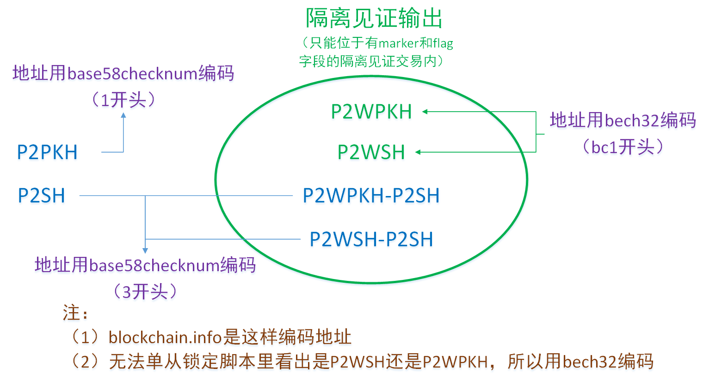

---
categories:
- 01 IT
- 01 Theory
- How a Software Works
- 1_Blockchain
date: '2020-11-01T11:36:09'
excerpt: ''
publish: true
sticky: 1
tags: null
title: 比特币脚本与地址笔记
updated: '2023-05-07T20:03:06'
---

# 比特币脚本与地址笔记

## 一些概念的部分解释

- 非压缩式公钥：65字节，十六进制表示以04开头；
- 压缩式公钥：33字节，十六进制表示以02、03开头；
- 公钥哈希：20字节；
- 脚本哈希：20字节（或者32字节，但是没有见过实例）；
- 地址（由公钥哈希和脚本哈希组装和编码而来）：
	- P2PKH型：十六进制以1开头，例如`1BvBMSEYstWetqTFn5Au4m4GFg7xJaNVN2`，由公钥哈希组装和编码而来；
	- P2SH型：十六进制以3开头，例如`3J98t1WpEZ73CNmQviecrnyiWrnqRhWNLy`，由脚本哈希组装和编码而来；
	- bech32型：bc1来头，例如`bc1qar0srrr7xfkvy5l643lydnw9re59gtzzwf5mdq`，它是前两种地址的另一种表达格式，现在blockchain.info只在有“native witness program”的时候使用这种格式；
- 签名：七十几字节（由第二个字节决定）；

## 研究的部分结论



### 非隔离见证交易（没有marker和flag的）

- 锁定脚本：`41<非压缩式公钥（65字节）>AC（1开头地址）`
- 锁定脚本(不太确定)：（P2PK型多重签名)OP_2 &lt;公钥1&gt; &lt;公钥2&gt; &lt;公钥3&gt; OP_3 CHECKMULTISIG(0xAE)（1开头地址）
- 锁定脚本：76A914&lt;公钥哈希&gt;(20bytes)88AC（1开头地址）
- 锁定脚本：76A914&lt;公钥哈希&gt;(20bytes)87AC（1开头地址）
- 锁定脚本：A914&lt;脚本哈希&gt;(20bytes)87（3开头地址）
- 锁定脚本：6A&lt;data&gt;(40bytes?)（没有地址，资金锁住了）

### 隔离见证交易（有marker和flag的）

- 锁定脚本：0014&lt;哈希&gt;(20bytes)（bc1开头地址）
- 锁定脚本：0014&lt;哈希&gt;(20bytes)（bc1开头地址）
- 锁定脚本：A914&lt;脚本哈希&gt;(20bytes)87（3开头地址）
- 锁定脚本：A914&lt;脚本哈希&gt;(20bytes)87（3开头地址）

## 非隔离见证交易

### P2PKH（Pay-to-Public-Key-Hash）

#### 单签名（第一种）

//解锁脚本：&lt;Signature&gt; &lt;Public Key&gt; OP_DUP OP_HASH160
锁定脚本：OP_DUP(0x76) OP_HASH160(0xA9) PUSHDATA20(0x14) &lt;Public Key Hash&gt;(20bytes) OP_EQUAL(0x87) OP_CHECKSIG(0xAC)

举例：（书上说有这种交易，没有找到实例）

#### 单签名（第二种）

//解锁脚本：&lt;Signature&gt; &lt;Public Key&gt; OP_DUP OP_HASH160
锁定脚本：OP_DUP(0x76) OP_HASH160(0xA9) PUSHDATA20(0x14) &lt;Public Key Hash&gt;(20bytes)  OP_EQUALVERIFY(0x88) OP_CHECKSIG(0xAC)

交易举例：99c2f5d3f1a1c89a4afa522361c55664e7777c71b02fd66cdf4e2ba190551d11、5a4ebf66822b0b2d56bd9dc64ece0bc38ee7844a23ff1d7320a88c5fdb2ad3e2

### P2PK（Pay-to-Public-Key）

#### 单签名

锁定脚本：PUSHDATA65BYTES(0x41) &lt;非压缩式公钥&gt;(65bytes) OP_CHECKSIG(0xAC)

(获取公钥后需要通过HASH160获得公钥哈希)

这是比特币最早的锁定脚本，coinbase一般是这种形式。

交易举例：创世区块的交易

### 多重签名

锁定脚本：M PUSHDATA65(0x41) &lt;Public Key 1&gt; PUSHDATA65(0x41)
&lt;Public Key 2&gt; ... PUSHDATA65(0x41) &lt;Public Key N&gt; N OP_CHECKMULTISIG(0xAE)

（因为实例没有找到，这个锁定脚本形式有待验证，因为M是个操作数，但是之前没有操作码）

交易举例：（没找到）

### P2SH（Pay-to-Script-Hash）

赎回脚本（2-3）：
OP_2(0x52)
OP_PUSHDATA33BYTES(0x21)&lt;压缩式公钥1&gt;
OP_PUSHDATA33BYTES(0x21)&lt;压缩式公钥2&gt;
OP_PUSHDATA33BYTES(0x21)&lt;压缩式公钥3&gt;
OP_3(0x53)
OP_CHECKMULTISIG(0xAE)

解锁脚本：
OP_PUSHDATA?BYTES &lt;Sig1&gt;
OP_PUSHDATA?BYTES &lt;Sig2&gt;
OP_PUSHDATA?BYTES &lt;赎回脚本&gt;

锁定脚本：
HASH160(0xA9) 
PUSHDATA20(0x14) &lt;脚本哈希（赎回脚本的HASH160）&gt;(20bytes) OP_EQUAL(0x87)

举例：
txid为`521f7c6781ced91da6cc8eb4c64b283d2e99f98627daf8a3a0c60432d8e8f601`的输入

解锁脚本：

```
00//这是要注意！这是什么？？？版本号？
OP_PUSHDATA71BYTES(0x47)
3044022027eec2f3081b87d271e32e126c9ccb4d2c4afa7ef14f7cff644723784b720ede02203e278a13e3544bd32abe6592e4e17a7331272db4a2b780113ed24e3ca3c37f3201//签名1
OP_PUSHDATA72BYTES(0x48)
30450221009e450de0b27f95db02d7ab8b5943c62b8e2f50eabfb017f509684c4f58892d7802203b8640c5f17b8e6239a65f66bbb26ea952dac9d0eefffd114d97878b2ac1da4f01//签名1
OP_PUSHDATA1(0x4c)69
OP_2(0x52)
OP_PUSHDATA33BYTES(0x21)
02ca355b567bff51c9b4a1c1590e25f685f8d12273efb7f7685a50e546786d0de7//公钥1
OP_PUSHDATA33BYTES(0x21)
03e5fa93cffa7533c6b68906c4a9b8665f5167f3ed95b830328835ca4d39b6495f//公钥2
OP_PUSHDATA33BYTES(0x21)
03ee6664f625e0a44fad0ad53ae1ecdc7c7239346b81514e8f87cfd2be4f8fec21//公钥3
OP_3(0x53) 
OP_CHECKMULTISIG(0xae)
```

锁定脚本：

```
a914d0982dd391d674f101898e8500586019e01d9aa787
```

## OP_RETURN

锁定脚本：OP_RETURN(0x6A) &lt;data&gt;(40bytes?)

输出不能被花费。

## 纯隔离见证交易

　　witness_version在witness字段内，锁定脚本必然以一个版本号开头

### P2WPKH（pay-to-witness-public-key-hash）

witness: &lt;signature&gt; &lt;pubkey&gt;
解锁脚本: 空
锁定脚本: witness_version(0x00) PUSHDATA20BYTES(0x14) &lt;公钥哈希&gt;(20bytes)


交易举例：没有找到实例……

### P2WSH（pay-to-witness-script-hash）

witness: witness_version(0x00) OP_PUSHDATA?BYTES &lt;签名1&gt; OP_1 OP_PUSHDATA33BYTES &lt;压缩式公钥1&gt; OP_PUSHDATA33BYTES &lt;压缩式公钥2&gt; OP_2 OP_CHECKMULTISIG(0xAE)
解锁脚本: 空
锁定脚本1: witness_version(0x00) PUSHDATA32BYTES(0x20) &lt;脚本哈希&gt;(32bytes)
锁定脚本2: witness_version(0x00) PUSHDATA20BYTES(0x14) &lt;脚本哈希&gt;(20bytes)
锁定脚本3: witness_version(非0x00) PUSHDATA任意BYTES &lt;脚本哈希&gt;(任意bytes)
(注意：P2SH的脚本哈希只有20字节，这里可以20字节或者32字节，32字节是为了防碰撞)

交易举例：txid为`d38f496e1004895c52d35bfe392800024b78b40e30dd063c4728058088ea0620`交易的输入

witness：

```
04//？？
witness_version(0x00)
47
304402203f87ea2cb39bf7b57f0ada40cfa7178a7b11548767d17be57e0e3a9ed818e53902202323afa3875a9917bf8227051ea5805ea5bc7a71f1ef8176884964a278aa2c2b01//签名
47
304402201055076d4a5284509a8c3e01abbe5e34e4fd79fe823914821bcaa7924333e0e40220495237c0d9acd7f16357de8c89e4eaab620ce5d26b810214e96272f4cf27b54e01//签名
OP_VERIFY(0x69)
OP_2(0x52)
21
0375e00eb72e29da82b89367947f29ef34afb75e8654f6ea368e0acdfd92976b7c//公钥
21
03a1b26313f430c4b15bb1fdce663207659d8cac749a0e53d70eff01874496feff//公钥
21
03c96d495bfdd5ba4145e3e046fee45e84a8a48ad05bd8dbb395c011a32cf9f880//公钥
OP_3(0x53)
ae
```

## 将P2WPKH和P2WSH的witness program嵌入P2SH赎回脚本的部分

　　witness_version在解锁脚本内。

### P2WPKH nested in BIP16 P2SH

witness: &lt;signature&gt; &lt;pubkey&gt;
解锁脚本: PUSHDATA22BYTES(0x16) witness_version(00)PUSHDATA22BYTES(0x14) &lt;公钥哈希&gt;(20bytes)
锁定脚本: OP_HASH160(0xA9) PUSHDATA20BYTES(0x14) &lt;脚本哈希&gt;(20bytes) OP_EQUAL(0x87)

举例：交易c420d6cf09973d4a539cb17acdc42a3a89a89e0d6e28938a37951085d8433125的输出

### P2WSH nested in BIP16 P2SH

witness:0 &lt;signature1&gt; &lt;1 &lt;pubkey1&gt; &lt;pubkey2&gt; 2 CHECKMULTISIG&gt;
解锁脚本1: PUSHDATA34BYTES(0x22) witness_version(00) PUSHDATA32BYTES(0x20) &lt;脚本哈希&gt; (32bytes)
解锁脚本2: PUSHDATA22BYTES(0x16) witness_version(00) PUSHDATA20BYTES(0x14) &lt;脚本哈希&gt; (20bytes)
锁定脚本: OP_HASH160(0xa9) OP_PUSHDATA20(0x14) &lt;20-byte-hash&gt; OP_EQUAL(0x87)

交易举例：
- 4967d6427b17a17e91b524e9a4f8a810182c5f9995fd07fe2eab71d9cc96ecc0