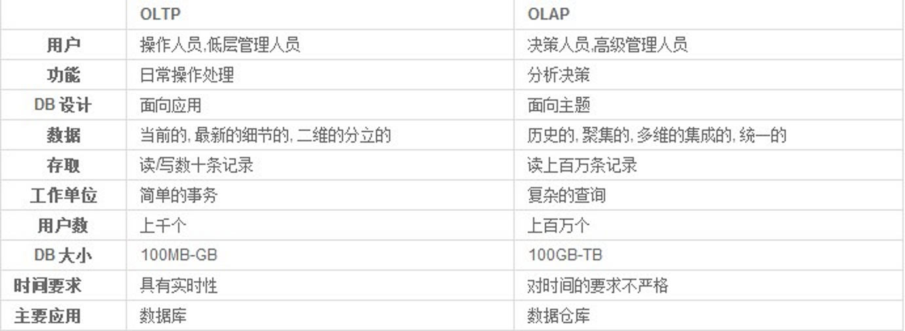

# 企业级应用笔记

## 常见概念

- SOA（Service-oriented Achitecture）
- ESB（Enterprise Service Bus） ：企业服务总线
- MQ Middleware（Message Queue Middleware） 

　　消息队列中间件主要用于各项服务订阅和发布消息。

- OLTP（On-Line Transaction Processing）和OLAP（On-Line Analytical Processing）

三层架构：表现层、业务层、持久层

## 分布式架构

- [分布式架构知识体系必读](分布式架构知识体系必读.pdf)
- [图说分布式架构的发展和演进](图说分布式架构的发展和演进.pdf)

## 微服务

## 参考

[^1]: [一文详解微服务架构](https://mp.weixin.qq.com/s/SH6OqbYNA5xCmjvHqq_1xQ)
