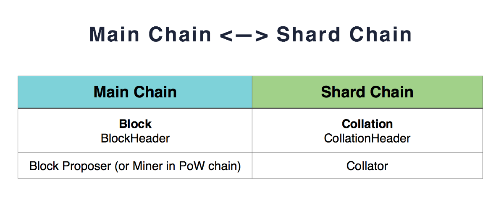
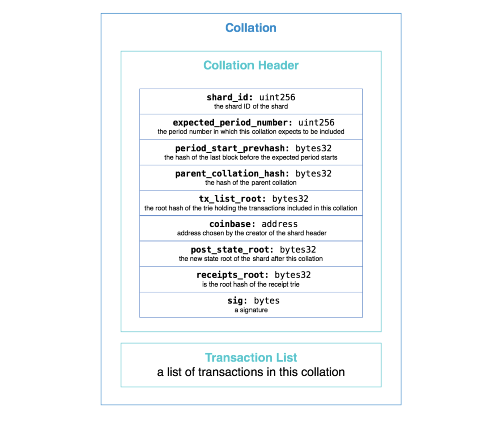
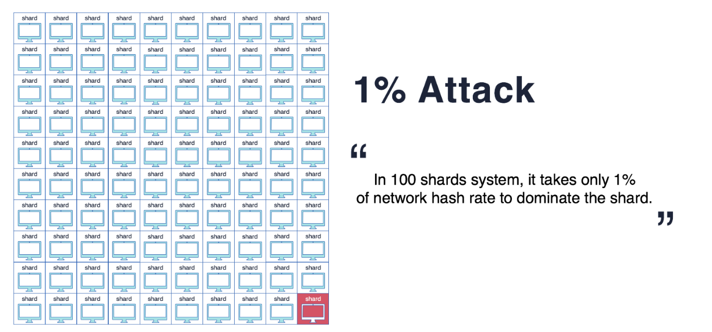
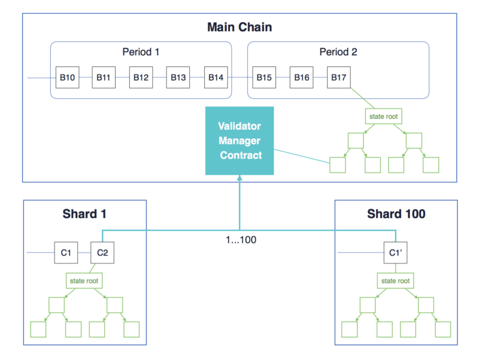
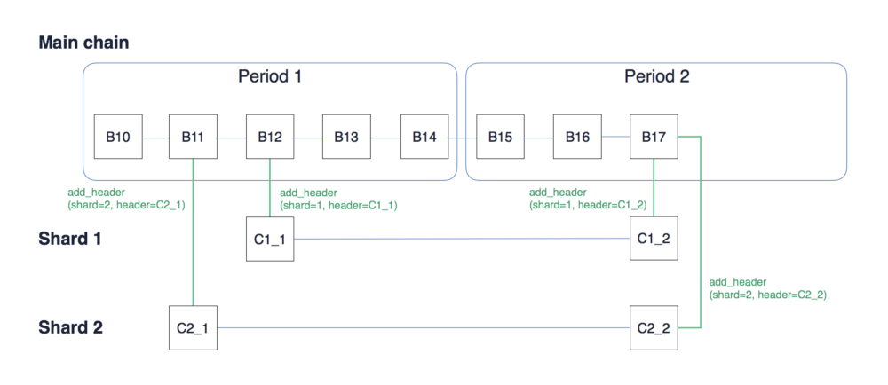

# 以太坊Sharding笔记

## Sharding（分片）

参考：
[https://medium.com/@icebearhww/ethereum-sharding-and-finality-65248951f649](https://medium.com/@icebearhww/ethereum-sharding-and-finality-65248951f649)（推荐从这个看起，这个最简单）
<https://github.com/ethereum/wiki/wiki/Sharding-FAQ>（Vitalik的关于sharding的问答）
<http://ethfans.org/posts/Sharding-FAQ>（上文的翻译）
<https://www.coindesk.com/information/will-ethereum-scale/>
[https://medium.com/@rauljordan/how-to-scale-ethereum-sharding-explained-ba2e283b7fce](https://medium.com/@rauljordan/how-to-scale-ethereum-sharding-explained-ba2e283b7fce)

validator：验证者
collator：整理者、校对者

### 简介

　　目前，在所有的区块链协议中每个节点存储所有的状态（账户余额，合约代码和存储等等）并且**处理所有的交易**。这提供了大量的安全性，但极大的限制了可扩展性：**区块链不能处理比一个单节点更多的交易**。很大程度上因为这个原因，比特币被限制在每秒3-7笔交易，以太坊每秒7-15笔交易，等等。然后，这提出了一个问题：是否有方法创建一个新的机制，只让一个小集合的节点来验证每笔交易？只要有足够多的节点验证每笔交易那么系统依然是高度安全的，但又足够少使得系统系统可以并行处理很多的交易，我们是否可以使用这种技术来大大增加区块链的吞吐量？

　　以太坊Sharding就是采用这种思想设计的。和比特币闪电网络的目的相同，他们都是为了提高系统的吞吐量的等指标。

## Sharding的整体结构

　　我们看到Sharding跟比特币闪电网络的精神有相通之处，即避免大量交易进入主链，避免每笔交易都要所有验证者进行验证。

　　在每个分片内，每一个时间段内collators会产生的被称为collation的数据结构，collation会把打包这个时间段产生的交易。它的过程和主链上的矿工打包区块的过程相似。

### collator和collation

　　在一个分片内有多个名为collator的节点，collator是从validators中随机抽取的。每个collator都有创建一个collation的任务。一个collation是长这样的：

collation包含有该分片的重要信息。collation就像对这个分片的状态和交易的“迷你描述”。collation header内容包括：

- 对应哪个分片
- 分片中所有交易被apply之前的分片的**状态**（具体应该是状态根哈希）
- 所有交易被apply之后的分片的**状态**（具体应该是状态根哈希）
- 至少2/3的collators的签名，证明collation是合法的

　　所谓**状态**在以太坊中指所有账户和对应的余额、智能合约代码、给定时间的nounces的集合。

　　**超级节点**把自己知道的所有分片的的**证明**记录在主链上，就像侧链锚定一样。

　　如果满足以下条件，那么这个区块是合法的：

- 所有collations里的的交易都是合法的
- 交易前collations的状态和collations现在的状态相同
- 交易后collations的状态和collation headers指定的状态相同
- 2/3签名

　　总而言之，collators是维持一个分片存在的角色。

### 异步跨分片交易

　　用户可以在某个分片上发一笔交易：锁定一些ether，并在主链上生成一个receipt。另一个shard的用户可以发一笔receipt-consuming transaction，附上receipt ID来花费这笔交易。

　　A(Shard1上的地址) 想给B（Shard10地址）发送100ETH ：
（1）Shard1把A余额减100，系统等待交易完结。
（2）交易的收据（receipt）被创建。收据不保存在**状态**，而在默克尔树根，从而容易被验证。（？？？）
（3）交易和收据一起被发送到Shard10。Shard10检查收据是否仍未被花费。
（4）Shard10把B余额加100。并记录从Shard1送过来的收据被花费。
（5）Shard10创建可以被随后交易使用的收据。（？？？）

### 安全风险

　　攻击者可能控制单个分片的大部分collators从而控制某个分片，即所谓**单分片接管攻击**。超级节点会获得不合法的collation。

　　

　　解决的方法是，在每个分片的collators是随机抽取出的。validators不会提前知道会成为哪个分片的collator。每个分片会被分配一组collators。

　　以太坊改用PoS共识算法之后，全球有一组validators，collators会从中被随机抽取出。随机源必须要是一致的保证抽样是entirely compulsory，并且can’t be gamed by the validators in question。

### 验证者管理合约（Validator Manager Contract,VMC）

　　为了加入分片，肯定会使用这个智能合约，它有以下特征：

1. PoS系统。如果某个验证者（validator）行为不端，它的stack会被罚没。
2. 伪随机抽样（sampling）。上一个区块的哈希作为随机种子来抽取合适的collators。validators把自己的stack锁定在VMC，那么它们的validation code address将会被记录在全球验证者池列表中。多天前是无法预测某个validator会在在哪个**period**成为哪个分片的collator。
3. Collation header验证。VMC提供函数进行Collation header验证和记录。
4. 跨分片交易。
5. On-chain governance. With VMC as the parliament, it enables validators to vote on-chain.

　　对于所谓的period，目前VMC中`PERIOD_LENGTH = 5`，即每五个区块中，对于一个分片，只能有至多一个合法的collation。

　　所有分片的这个period的最新状态根会被记录在VMC的中，反映在VMC的状态。

### 分片链的分叉选择规则

　　遵循“最长主链中的最长分片链”。

### 仍然有的疑问

- collation是如何被进行多签名的？

　　

