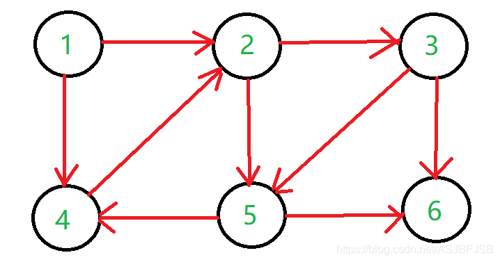
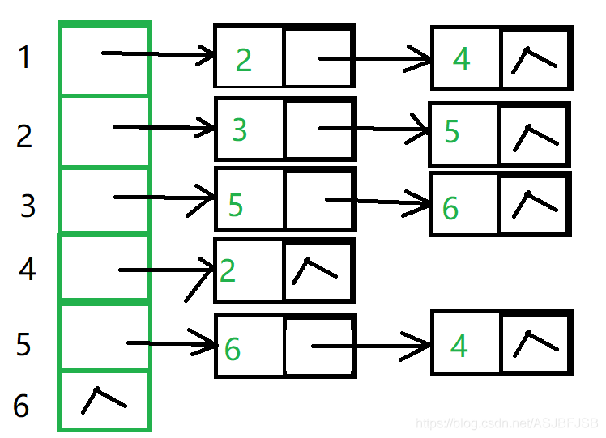
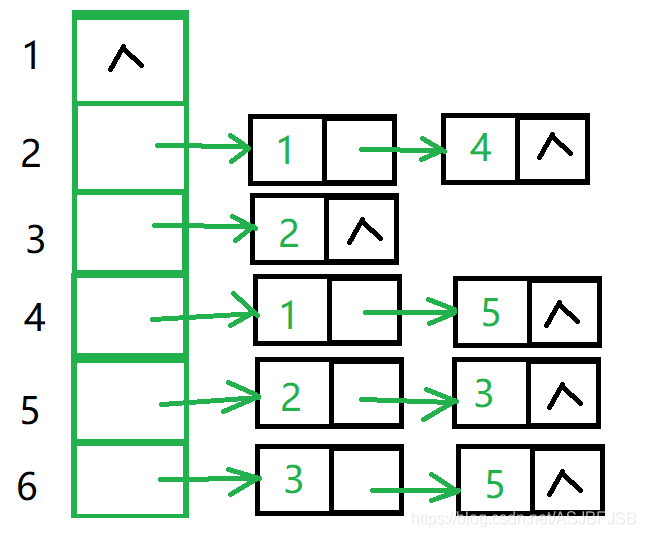
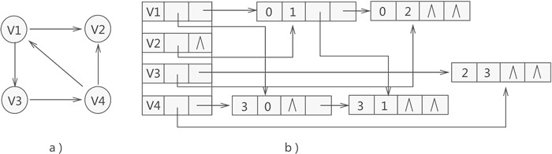
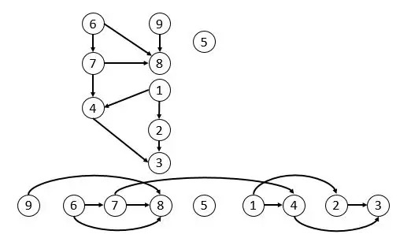

# 数据结构有向图笔记

## 有向图

　　与无向图类似，一个有向图一般可以用**邻接矩阵**表示，编程的时候可以使用二维数组。
　　
　　对于边较少的稀疏图，其邻接矩阵是稀疏矩阵，编程的时候可以使用被称为**邻接表**的数据结构记录，以减少空间使用。

　　邻接表虽然在空间上有很大的优势，但是对于一个有向图，如果需要查找每个顶点的入度就需要遍历整个邻接表，在效率上很低下的。因此有需求的话可以再记录一张逆邻接表。

　　可以看到同时记录邻接表和逆邻接表是有冗余的，另一种记录稀疏邻接矩阵的方法是使用**十字链表**（Orthogonal Linked List）数据结构。
　　

## 有向无环图（Directed Acyclic Graph，DAG）

### 拓扑排序

　　对于有向无环图而言，其拓扑排序为其所有结点的一个线性排序（对于同一个有向图而言可能存在多个这样的结点排序）。该排序满足这样的条件——对于图中的任意两个结点u和v，若存在一条有向边从u指向v，则在拓扑排序中u一定出现在v前面。
　　

　　拓扑排序一般使用卡恩算法或者深度优先搜索算法解决。
