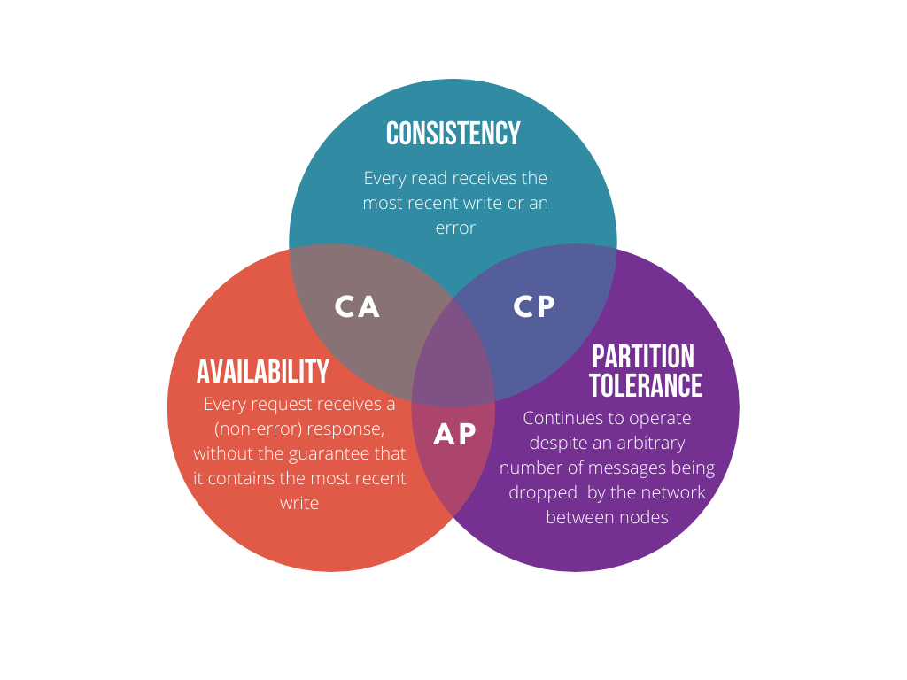
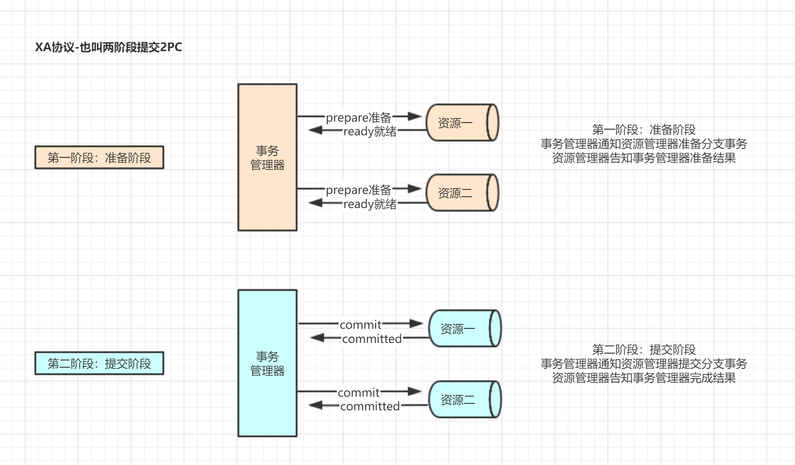
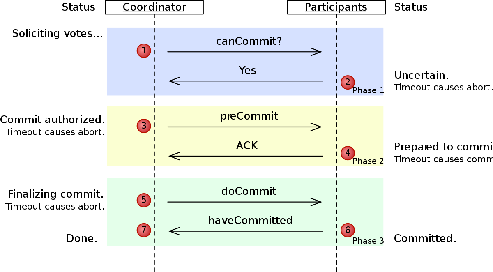

# 一致性协议与共识协议笔记

## CAP 理论

　　CAP 理论三个特性的详细含义如下：

1. 一致性（Consistency）：每次读取要么是最新的数据，要么是一个错误；
2. 可用性（Availability）：client 在任何时刻的读写操作都能在限定的延迟内完成的，即每次请求都能获得一个响应（非错误），但不保证是最新的数据；
3. 分区容忍性（Partition tolerance）：在大规模分布式系统中，网络分区现象，即分区间的机器无法进行网络通信的情况是必然会发生的，系统应该能保证在这种情况下可以正常工作。[^2]

## 2PC 协议（Two-phase Commit Protocol）

　　2PC 协议可以保证强一致性。

## 3PC 协议（Three-phase Commit Protocol）

　　三阶段提交（Three-Phase Commit， 3PC）协议最关键要解决的就是 Coordinator 和参与者同时挂掉导致数据不一致的问题，所以 3PC 把在 2PC 中又添加一个阶段，这样三阶段提交就有：CanCommit、PreCommit 和 DoCommit 三个阶段。[^2]

## Paxos

　　Leslie Lamport在1990年公开发表在了自己的网站上，是最早出现的共识算法。
　　
### Paxos 和 2PC 的区别

　　2PC协议用于保证属于多个数据分片上的操作的原子性。这些数据分片可能分布在不同的服务器上，2PC协议保证多台服务器上的操作要么全部成功，要么全部失败。 
　　Paxos协议用于保证同一个数据分片的多个副本之间的数据一致性。当这些副本分布到不同的数据中心时，这个需求尤其强烈。
　　
## Raft

　　在一个由 Raft 协议组织的集群中有三类角色：[^1]

- Leader（领袖）
- Follower（群众）
- Candidate（候选人）

　　一开始群众都是候选人，定期选举出一个领袖。以后所有新增数据都发给领袖，由领袖发给其他群众，其他群众给领袖发确认，最后达成一致。领袖用心跳保持存在感，领袖在任意时候挂了，都有解决方案。

　　RAFT协议设计本身无法防止拜占庭错误。
　　

## Paxos

　　Leslie Lamport在1990年公开发表在了自己的网站上，是最早出现的共识算法。

## 一致性协议与共识协议区别

　　共识协议想要解决的是，对某个提案，多个节点如何达成一致意见并正确实施。例如Paxos。

　　一致性协议想要解决的是，对于同一数据的在多节点的多副本之间，如何保持其对外表现的数据是一致的。

## 参考

[^1]: [Raft 为什么是更易理解的分布式一致性算法](https://www.cnblogs.com/mindwind/p/5231986.html)

[^2]: [分布式系统的一致性协议之 2PC 和 3PC](https://matt33.com/2018/07/08/distribute-system-consistency-protocol/)

　　
