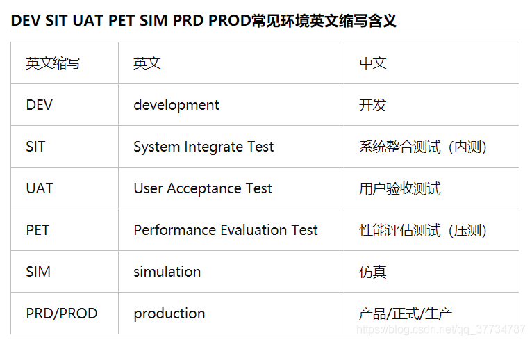

# 软件测试笔记

## 什么是测试用例

　　测试用例就是测试人员用以测试被测软件的某个特性或特性组合的一组数据。这组数据可能是从用户处得来的实际的一组数据，也可能是测试人员专门设计出来的测试软件某些功能的一组数据。
　　测试规程就是详细的对测试用例设计方法、测试方法、测试工具、测试环境和测试数据进行描述的文档，还可以包括能把某个或某一组测试用例应用到被测软件上完成某项测试的一系列的操作步骤。
　　设计测试用例应当从以下几方面考虑：边界值，等价类划分，有效/无效值等。
　　

## 常见测试类型

- 冒烟测试（Smoke Testing）
- 回归测试（Regression Testing）
- 集成测试（Integration Testing）
- 混沌测试（Chaos Testing）：模拟整个 IDC 当掉、选择一部分网络连连接注入特定时间的延迟、随机让一些函数抛出异常、强制 NTP 时间不同步、生成 IO 错误、榨干 CPU等。

## 常见系统测试环境

[^1]

## 参考

[^1]: [DEV、SIT、UAT、PET、SIM、PRD、PROD缩写介绍](https://blog.csdn.net/qq_37734787/article/details/111596331)
