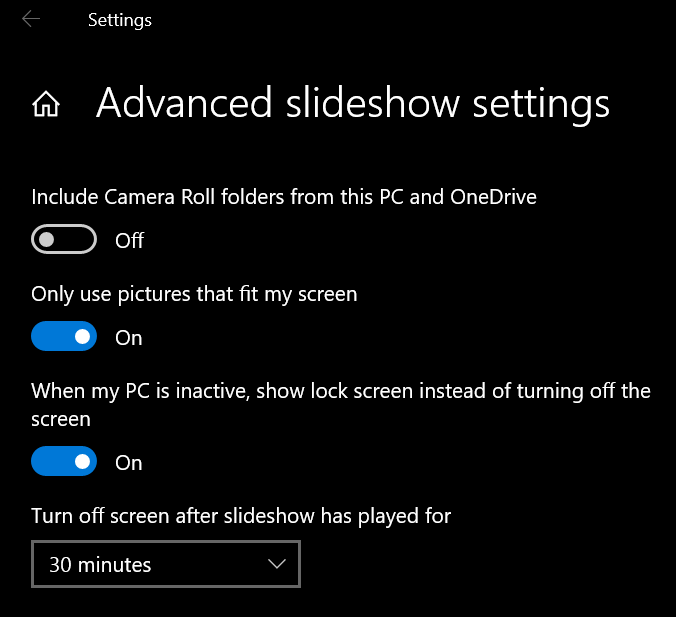
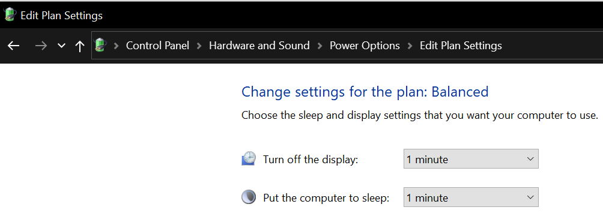

# Windows 笔记

## KMS激活方法

```cmd
slmgr /skms kms.moeclub.org
slmgr /ato
```

## 常用快捷键

- Win+p：显示选项，外接屏幕时用到。

## 常用设置

### 更新后不重启

gpedit.msc > 计算机配置 > 管理模板 > Windows组件 > Windows 更新 > 对于有已登录用户的计算机，计划的自动更新安装不执行重新启动。

### hosts文件

`C:\Windows\System32\drivers\etc\hosts`

### 开始菜单

所有用户：`%ProgramData%\Microsoft\Windows\Start Menu`

单用户：`%AppData%\Microsoft\Windows\Start Menu`

### 开机启动

Put executed files into `C:\ProgramData\Microsoft\Windows\Start Menu\Programs\StartUp`.

### 以太网有线连接设置流量限制

参见[配置Windows 10以太网有线连接为「计量」连接类型](https://www.sysgeek.cn/windows-10-set-ethernet-connection-metered/)

### 无TPM模块时对系统盘进行Bitlocker加密

　　`Win键+R`打开运行窗口，输入`gpedit.msc`进入本地组策略编辑器。展开`计算机配置-管理模板-Windows组件-BitLocker驱动器加密-操作系统驱动器（Reqiure additional authentication at startup）`，找到“启动时需要附加身份验证”，将其配置为”已启用”并且勾选”没有兼容的TPM时允许BitLocker（在U盘上需要密码或启动密钥）”。

### 封闭USB口

　　封闭USB口有好多方法,其中一个是将注册表中`HKEY_LOCAL_MACHINE\SYSTEM\CurrentControlSet\Services\USBSTOR`里`Start`的值改为4（禁止自动启动），默认为3（自动分配盘符）。

### 关闭应用执行别名功能

　　Win10中输入`python`、`python3`会弹出Microsoft Store，这是应用执行别名功能，微软希望你去Microsoft Store下载安装python。

　　Windows搜索中（Win+q）输入“Manage app execution aliases”（"管理应用执行别名"），然后关闭这俩应用执行别名。

### 合并任务栏按钮（直接修改注册表方式）

HKEY_CURRENT_USER\Software\Microsoft\Windows\CurrentVersion\Explorer\Advanced

TaskbarGlomLevel（类型：REG_DWORD）项

值为 0，始终合并；1，已满时合并；2，从不合并。

### 移除UWP访问本地回环地址限制

#### 方法1

　　UWP默认无法访问回环地址localhost。可以使用CheckNetIsolation.exe移除这个限制。

　　允许邮件与日历使用代理软件。以管理员权限打开cmd，并键入以下内容：

```cmd
CheckNetIsolation.exe LoopbackExempt -a -p=S-1-15-2-2551677095-2355568638-4209445997-2436930744-3692183382-387691378-1866284433
rem 貌似这个没用？
CheckNetIsolation.exe LoopbackExempt -a -p=S-1-15-2-2750798217-1343590035-1234819260-1030354384-3318145141-3720257911-3461195215
```

#### 方法2

　　使用[EnableLoopback Utility](http://www.apprcn.com/enableloopback-utility.html)，与Fiddler功能类似。
　　
### 修改路由

```cmd
rem 删除路由，最后一项为目标
route delete 0.0.0.0 mask 0.0.0.0 25.202.78.254
route delete 0.0.0.0 mask 0.0.0.0 30.18.40.254
rem 增加路由，最后一项为目标
route add 10.41.0.0 mask 255.255.0.0 30.18.40.254
route add 10.21.0.0 mask 255.255.0.0 30.18.40.254
route add 215.9.0.0 mask 255.255.0.0 30.18.40.254
```

## 自动睡眠设置研究

因为电脑经常无法自动睡眠，所以对闲置自动睡眠的配置进行了研究（针对Win10）。

首先，管理员权限下执行`powercfg -requests`，如果其中有应用（例如热点）在进行电源请求，则无法闲置自动睡眠。

其次，锁屏后的设置了Slideshow，其进程“\Windows\System32\LockScreenContentServer.exe”也会阻止闲置自动睡眠。幸好Slideshow有超时关闭屏幕的设置：



其中可以设置关闭屏幕的时间，最短为30分钟。如果想设置任意时间，可以设置注册表的`HKEY_CURRENT_USER\SOFTWARE\Microsoft\Windows\CurrentVersion\Lock Screen`项下的`SlideshowDuration`，其值为十六进制，单位为毫秒。

控制面板下的电源控制面板中可以设置关闭屏幕时间：



但是只要锁屏Slideshow在运行，这两个设置会失效。因此只要设置了锁屏Slideshow，那么其中控制计算机睡眠的时间应该**略大于**锁屏Slideshow的运行时间。
