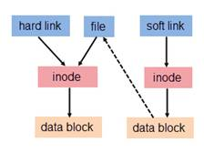

# Linux VFS 笔记

## 文件权限和文件类型

### 查看文件权限

　　`ls -lhs`命令输出例如“-rwxrw-r-- 1 root root 1213 Feb 2 09:39 <文件名或者目录名>”。

　　第一列的“-rwxrw-r--”，第一个字符代表文件类型，其余字符每3个一组（rwx），读（r）、写（w）、执行（x）。第一组rwx表示文件所有者的权限是读、写和执行。第二组rw-表示与文件所在组同组的用户只能读写但不能执行。第三组r--表示其他用户的只能读，不能写和执行。

　　第二列的1表示连接的文件数。

　　第三列的root表示文件所有者。

　　第四列的root表示文件所在组。

　　第四列的1213表示文件大小（字节）。

　　第五列的“Feb 2 09:39”表示最后修改日期。

**注**：

（1）对于普通文件，权限一般是“-rw-rw-r--”；对于目录，权限一般是“drwxr-xr-x”。
（2）对于目录来说，当前用户只有对它和它往上所有父目录有执行权限x才能进入目录。
（3）对于创建一个文件或者目录，要求对直接父目录有写权限w和执行权限x，对再往上的父目录有执行权限x。
（4）对于删除一个文件或者目录，要求对直接父目录有写权限w和执行权限x，对再往上的父目录有执行权限x。

### Linux下文件类型

1. （-）普通文件（硬链接是普通文件）

2. （d）目录文件，记录文件名和inode的对应关系。

3. （l）软链接/符号链接文件

4. （b）块文件，设备文件的一种

5. （c）字符文件，设备文件的一种

### 目录文件权限分析

目录文件其实就是个map，所以它的r和读取文件名有关、w和增删条目有关，x和获取inode号有关：

r-x：可以进入cd该目录，可以获得该目录下存储情况，但是不能修改这个目录内部存储的文件（目录）的名字，也不能在该目录下新建文件和目录

-wx：可以进入cd该目录，但是看不到该目录下的存储情况（ls不可用），可以往该目录下添加、修改、删除文件。可以通过cat来读取该目录下的文件or目录的内容，由于得不到该目录下存储了那些文件，在不知情的情况下只能通过猜，cat + 文件名获得文件内容，所以这样依然不保密。

--x：可以进入cd该目录，看不到存储情况，也不能往该目录下添加、修改、删除文件。但是依然可以通过cat + xx（猜）来获得该目录下的文件的内容。

rw-：不能进入cd该目录，用ls仅仅可以获得文件名和目录名，因为获取不到这些文件的inode号，当然也不能获得该目录下的文件的内容。不能往该目录下添加、修改、删除文件。

## 修改文件权限

```sh
//赋予abc权限rwxr-xr-x
chmod 755 abc
//同上u=用户权限，g=组权限，o=其他用户权限
chmod u=rwx，g=rx，o=rx abc
//给abc去除用户执行的权限，增加组写的权限
chmod u-x，g+w abc
//给所有用户添加读的权限
chmod a+r abc
//改变abc的所有者为xiaoming（参数-R表示改变所有子目录子文件所有者）
chown xiaoming abc
//改变abc所属的组为root（参数-R表示改变所有子目录子文件所属组）
chgrp root abc
```

### 其他

　　（这句话有疑问，还需要对`usermod -a -G <其他组名> www-data`进行实验）对于apache2这种程序，它在访问文件或者目录时有执行用户和执行用户组的概念（一般为www-data和www-data）。如果执行用户组和文件或者目录的所属组相同，那么文件或者目录的所属组权限生效；如果执行用户和文件或者目录的所有者相同，那么文件或者目录的所有者权限生效。

## inode

　　

```c
struct inode {
    struct hlist_node   i_hash;     /* hash链表的指针 */
    struct list_head    i_list;     /* backing dev IO list */
    struct list_head    i_sb_list;  /* 超级块的inode链表 */
    struct list_head    i_dentry;   /* 引用inode的目录项对象链表头 */
    unsigned long       i_ino;      /* 索引节点号 */
    atomic_t            i_count;    /* 引用计数器 */
    unsigned int        i_nlink;    /* 硬链接数目 */
    ...
```

## 硬链接与软链接

### 硬链接

　　目录存储的是文件名和inode号的映射。

　　所以硬链接其实就是多个文件名指向同个inode，inode会记录有多少文件名指向它（i_nlink）。

　　另外不能跨文件系统进行硬链接的创建；不能对目录进行硬链接的创建。

### 软链接



　　可以指向不存在的文件或者目录。

　　使用`ln -s <源路径> <目标路径>`创建软链接注意要都使用绝对路径。
　　
## 挂载远程Samba目录

　　在/etc/fstab添加如下内容：

```
//<IP>/<Directory name> <Mount directory> cifs username=<Username>,password=<Password>,uid=1000,gid=1000,file_mode=0640,dir_mode=0750 0 0
```

　　如果想要修改后立刻生效，执行以下命令：

```sh
sudo mount -a
```

## 参考

[^1]: <https://www.jb51.net/LINUXjishu/542222.html>

[^2]: <https://blog.csdn.net/ty_laurel/article/details/51407107>

