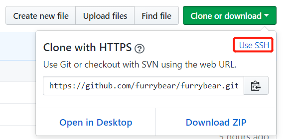

# 使用密钥操作Github仓库

　　Github支持使用SSH协议或者HTTPS协议操作平台上的Git仓库，例如克隆、推送等操作。使用SSH协议时，仓库的地址大致类似`git@github.com:<用户名>/<仓库名>.git`；使用HTTPS协议时，仓库的地址大致类似`https://github.com/<用户名>/<仓库名>.git`。

　　使用SSH协议操作Github仓库时，需要使用SSH密钥或者GPG密钥。使用SSH密钥原理上与使用SSH密钥免密码登录服务器一致。

## 具体操作

　　以Windows系统为例，打开终端，执行

```sh
ssh-keygen -t rsa
```

　　在`系统盘:\用户\用户名\.ssh`下生成私钥文件id_rsa和公钥文件id_rsa.pub。复制公钥文件内的内容，在Github网站上的`Settings → SSH and GPG Keys`页中里添加公钥。

　　在需要操作的仓库页面，点击如下“SSH”页下的仓库地址：



　　在终端中执行`git clone <仓库地址>`，就可以克隆仓库到本地。
