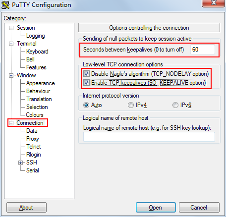

# Putty的免密SSH登陆

参考：<https://jingyan.baidu.com/article/17bd8e5259dab585aa2bb853.html>

　　用puttygen.exe这个工具，生成.ppk文件（里面有公钥和私钥）和公钥。先把公钥给服务端。然后putty载入.ppk文件（Connection→SSH→Auth），就可以免密码登录了。

　　在putty的Connection→Data里设置用户名，还可以免输入用户名。

# 连接保活

