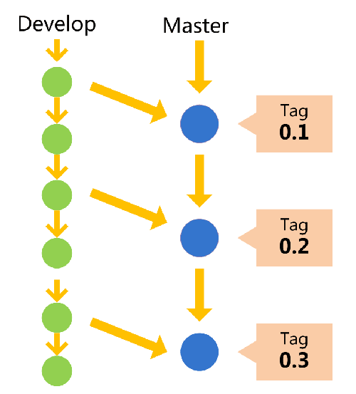

# Git 命令行笔记

## 常见命令

### git clone

　　主要用于克隆仓库。

```sh
# 只克隆这个仓库
git clone <远程仓库的URL>
# 克隆这个仓库和它的所有子模块
git clone --recursive <远程仓库的URL>
# 只克隆最新的提交
git clone --depth 1 <远程仓库的URL>
# 将上述浅克隆改为完整克隆
git fetch --unshallow
```

　　值得注意的是，`git clone <URL>`默认是克隆远程仓库里HEAD指向的分支，默认是master分支。如果是多分支，我们可以克隆远程仓库的某个分支：

```sh
git clone -b <分支名> <URL>
```

　　如果克隆的是一个空仓库，会报“warning: remote HEAD refers to nonexistent ref, unable to checkout.”警告，因为远程仓库没有任何commit，所以HEAD不指向任何commit。

### git checkout和git branch

　　检出分支和查看分支情况

```sh
# 创建新分支，新分支会有和之前分支相同的提交历史（commit history）
git checkout -b <分支名>
# 创建新分支，新分支没有提交历史
git checkout --orphan <分支名>
# 检出已经存在的分支
git checkout <分支名>
# 查看本地仓库有哪些分支
git branch
# 删除本地分支
git branch -d <分支名>
# 查看本地分支与远程分支的追踪情况
git branch -vv
# 分支改名
git branch -m <旧分支名> <新分支名>
# 查看所有分支（包括远程分支）
git branch -a
# 查看所有远程分支
git branch -r
## 查看分支是否包含提交
git branch --contains <Commit Hash / Branch Name / Tag Name> <Branch Name>
# 创建本地分支dev，该分支与远程dev分支相同
git checkout -b dev origin/dev
```

### git log

```sh
# 查看提交(commit)历史
git log
# 以图的形式查看提交之间的关系
git log --graph
# 每个提交只显示提交ID
git log --graph --oneline
```

### git commit

　　将暂存区记录的改动添加到本地仓库创建一个新的commit。

```sh
# 创建一个新的commit，HEAD指针指向这个commit
git commit -m "<commit message>"
# 删掉HEAD指针指向的commit，创建一个新的commit，HEAD指针指向这个commit
git commit --amend -m "<commit message>"
# 更新最近一次的提交，不改变提交信息，但是修改提交时间为现在
git commit --amend --date=now --no-edit
```
### git status和git diff

```sh
# 查看工作区和暂存区文件改动涉及的文件（和HEAD比较）
git status
# 查看工作区的文件改动（和HEAD比较）
git diff
# 查看暂存区的文件改动（和HEAD比较）
git diff --cached
```

### git remote

　　管理远程主机。
　　
```sh
# 为远程主机设置多个URL
git remote set-url --add <主机名> <URL>
# 更新本地的远程追踪分支
git remtoe update
# 删除本地的远程主机中没有对应分支的远程追踪分支
git remote prune <主机名>
```

### git push

　　将本地分支推送到远程分支。注意，如果本地分支和远程分支的提交历史中如果有不同commit（一般发生在分支上用`git reset`回退版本再commit后），将无法推送，除非加`-f`参数强行覆盖远程分支。

```sh
# 将本地分支推送到它追踪的远程分支
git push
# 将本地分支推送到某个远程分支
git push <远程主机名> <本地分支名>:<远程分支名>
# 将本地分支推送到某个远程分支并建立追踪关系
git push --set-upstream <远程主机名> <本地分支名>:<远程分支名>
git push -u <远程主机名> <本地分支名>:<远程分支名>
# 删除远程主机上的分支
git push <远程主机名> --delete <远程分支名>
# 删除远程主机上的标签
git push <远程主机名> :ref/tags/<标签名>
```

### git reset

　　主要用于在分支上回退版本。
　　
```sh
# 将暂存区所有文件改动清除
git reset
```

　　对于git reset三个参数“--soft”、“--mixed”（默认）和“--hard”，区别如下：

```sh
# 本地版本库的头指针重置到指定版本，并将这次提交之后的所有变更都移动到暂存区,工作区代码不变
git reset --soft <版本号> [<文件名1>,<文件名2>,…]
# 本地版本库的头指针重置到指定版本，并清空暂存区,工作区代码不变
git reset <版本号> [<文件名1>,<文件名2>,…]
# 本地版本库的头指针重置到指定版本，并清空暂存区，工作区代码也回退到这个版本
git reset --hard <版本号> [<文件名1>,<文件名2>,…]
```

### git rm

```sh
# 当需要删除暂存区或分支上的文件, 同时工作区也不需要这个文件了
git rm <文件名>
# 当需要删除暂存区或分支上的文件, 但本地又需要使用, 只是不希望这个文件被版本控制
git rm --cached <文件名>
```

### git merge

```sh
# 将s分支合并到当前分支，s分支不会消失；如果当前分支的提交历史是s分支的子集，那么合并后当前分支就有和s分支一样的提交历史了
git merge s
```
### git cherry-pick

　　将两个提交合并，与merge不同，可以挑选哪些改动进行合并。

### git rebase

　　可以对某一段线性提交历史进行编辑、删除、复制、粘贴；因此，合理使用rebase命令可以使我们的提交历史干净、简洁！

```sh
# 交互式地重整该提交之后的提交（不包括该提交）
git rebase -i <提交ID>
# 交互式地重整所有提交
git rebase -i --root
```

### git fetch

　　从远程仓库获取分支，更新本地的远程追踪分支，例如origin/master。

　　`git pull`就是`git fetch`+`git merge`。假设远程仓库里有master分支，`git fetch origin master`先将远程的master分支放到本地的origin/master，然后再切到本地master，和origin/master进行merge。

```sh
# 从远程仓库获取所有分支
git fetch --all
# 将工作区重整为origin/dev
git reset --hard origin/dev 
```
### git config

　　config 配置有system级别、global（用户级别）和local（当前仓库，存储在.git/config），下层配置会覆盖上层配置。

```sh
# 查看配置。
git config --system --list
git config --global --list
git config --local  --list
# 设置用户名。
git config user.name "Furrybear"
# 不忽略文件名大小写的修改。
git config core.ignorecase false
# 允许推送分支到本仓库（非裸仓库）。
git config --local receive.denyCurrentBranch ignore
# core.autocrlf为true时，代码检出时将LF转换为CRLF，提交时把CRLF转换为LF。在Git for Windows中这个变量初始时就是true。
git config --local core.autocrlf true
# 记住HTTP协议连接的仓库的用户名密码
git config --global credential.helper store
```
### git tag

参考：
- <http://www.ruanyifeng.com/blog/2012/07/git.html>
- <https://www.zhihu.com/question/28784805>

　　标签就是给一个版本再取个别名，一般标记一个里程碑版本的。可以给任何版本打标签，一般给master分支的节点打标签。



```sh
# 轻量级标签
git tag <标签名>  <commitID>
# 含附注标签
git tag -a <标签名> <commitID>
```
### git worktree

　　新建工作树，避免频繁切换分支的繁闹，比在本地克隆多个仓库方便。
　　
```shell
git worktree add [-f] [--detach] [--checkout] [--lock [--reason <string>]] [-b <new-branch>] <path> [<commit-ish>]
```

### git symbolic-ref

```sh
#设置裸仓库默认分支/设置HEAD指针指向
git symbolic-ref HEAD refs/heads/devel
```

### git submodule

```sh
# 添加子模块
git submodule add <仓库URL> [<目录名>]
```

克隆新项目后如何克隆子模块：

```sh
# 查看子模块情况
git submodule
# 初始化子模块
git submodule init
# 更新子模块到最新版本
git submodule update
# 修改.gitmodules文件后更新子模块信息
git submodule sync --recursive
```


## 常见用法

### 工作流

 　　工作流是多人使用git进行协作的时候管理代码的一种约定规范。

#### 简化的gitflow工作流

　　这种工作流里有俩分支：master和dev，分别是生产环境中使用的代码和开发测试环境使用的代码。

　　在dev分支工作完后：

```sh
# 如果功能开发完成了，可以合并主分支
git add .
git commit -m "提交理由"
# 切换到主分支
git checkout master
# 使用merge方法把dev分支的更改和master合并
git merge dev
# 提交主分支代码远程
git push
# 切换到dev远程分支
git checkout dev
# 提交dev分支到远程
git push
```

```sh
# 如果功能没有完成，可以直接推送
git add .
git commit -m "提交理由"
git push  # 提交到dev远程分支
```
