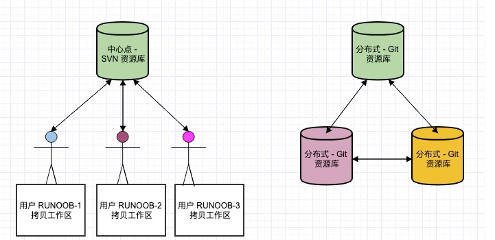

# Git 笔记

　　Git是一个分布式版本管理软件。

## 网络模型

<https://git-scm.com/book/zh/v1/%E6%9C%8D%E5%8A%A1%E5%99%A8%E4%B8%8A%E7%9A%84-Git-%E5%8D%8F%E8%AE%AE>



　　每个普通git仓库由工作区(Working Area)、 暂存区(Stage)和仓库（Repository）组成。

　　值得注意的是，git有**裸仓库**的概念。裸仓库是放在服务器上作为远程公共仓库被推送分支的，一般是不会直接用裸仓库工作。裸仓库目录下的内容就是平时看到的.git目录中的内容（包括hooks、ref之类的），也就是说，裸仓库没有工作区。裸仓库一般命名为“&lt;项目名&gt;.git”。

　　git仓库之间用本地协议、SSH协议（22端口、读写）、Git协议（9418端口、只读）、HTTP/S协议进行通信。

　　对于克隆（`git clone`）下来git仓库，自动会把远程仓库命名为origin（可以通过`git remote -v`查看）。


## 分支模型

<http://www.ruanyifeng.com/blog/2012/07/git.html>

<https://git-scm.com/book/zh/v1/Git-%E5%88%86%E6%94%AF-%E5%88%86%E6%94%AF%E7%9A%84%E6%96%B0%E5%BB%BA%E4%B8%8E%E5%90%88%E5%B9%B6>

<https://blog.csdn.net/trochiluses/article/details/8991701>

　　我个人理解，git的模型里，仓库中是由commit组成的无环有向图，每个commit是其中的一个节点，每个commit有个commit ID（是个哈希值）和commit message。每个commit可以指向零至多个其他commit，并可以被0~2个commit指向。

　　所谓的**分支（branch）**是某些前后相连的commit组成的一条路径，这条路径前后都不再有其他版本。当然分支内也可以没有commit。

　　平时检出（`git checkout`）出某个分支，指的是HEAD指针指向这个分支最后一个commit，并且工作区重整为这个commit的内容。值得注意的是，如果用`git checkout --orphan <新分支名>`或者`git checkout <已经存在的分支名>`切换到一个没有commit的空分支上，工作区的内容不会改变。

### 远程跟踪分支

　　名如origin/master（<主机名>/<分支名>）的分支是**远程跟踪分支**。

　　远程跟踪分支是远程分支状态的引用。 它们是不能移动的本地引用，当做任何网络通信操作时，它们会自动移动。 远程跟踪分支是上次连接到远程仓库时那个分支所处状态。

### 未追踪状态（untracked）

　　所谓的文件的**未追踪状态**是指文件被修改了但是没有被加入（没有用`git add <文件名>`）暂存区的状态，通过`git status`可以看到未追踪的文件（文件没有加入.gitignore文件的记录）。

### 标签（tag）

<http://www.ruanyifeng.com/blog/2012/07/git.html>

<https://www.zhihu.com/question/28784805>


　　标签就是给一个版本再取个别名，一般标记一个里程碑版本的。

　　可以给任何版本打标签，一般给master分支的节点打标签。


```sh
# 轻量级标签
git tag <标签名>  <commit>
# 含附注标签
git tag -a <标签名> <commit>
```

### 分支的追踪关系

　　对于有追踪关系的本地分支和远程分支，只要用`git push`就可以将本地分支推送到远程分支，否则要用`git push <远程主机名> <本地分支名>:<远程分支名>`。克隆（`git clone`）下来git仓库会自动建立和远程仓库的追踪关系。

## .gitignore

　　.gitignore文件能够让某些文件不进入版本控制：

```.gitignore
# 只忽略第一级目录下的这个文件或者目录
/<目录名>/
# 忽略所有有这个名字的文件或者目录
<目录名>/
# 忽略目录下所有文件但是不忽略某个文件
/<目录名>/*
!/<目录名>/<文件名>
```

## Git LFS，在 Git 中支持二进制大文件存储

对于大的二进制文件，可以使用Git LFS，避免大文件直接存储在仓库中，需要额外建立Git LFS服务器。

## 钩子（Hooks）

示例：仓库接受推送后后将工作区代码更新为最新版本，`.git/hooks/post-update`内容如下：

```sh
#!/bin/sh

# 注意，这很重要！
unset GIT_DIR

cd ..
git reset --hard HEAD
```

## 参考

[^1]: [Git - 协议](https://git-scm.com/book/zh/v2/%E6%9C%8D%E5%8A%A1%E5%99%A8%E4%B8%8A%E7%9A%84-Git-%E5%8D%8F%E8%AE%AE)
