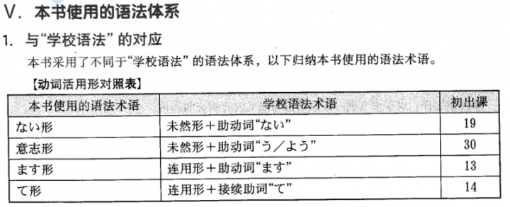
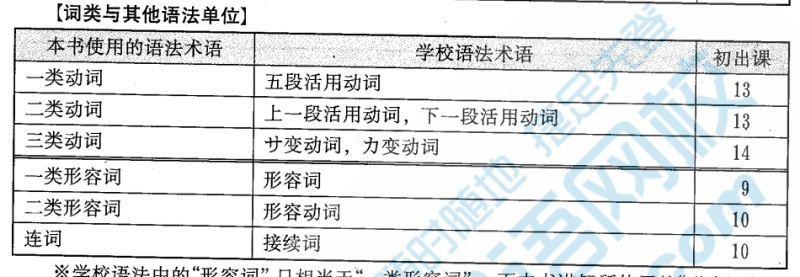

# 日语笔记

## 词性

　　标日中的语法体系和学校体系不太一样，下图[^2]展示如何对应到常见的日语语法体系：

### 动词

#### 动词分类

　　关于动词分类可以参考下图[^1]：

#### 动词活用

　　动词的活用形有未然形，连用形，终止形，连体形，假定形，命令形，推量形，以下是一些用法：

- 连用形+助动词“ます”
- 连用形+助动词“たい”
- 连用形+接续助词“て”
- 未然形+助动词“ない”
- 未然形+助动词“う/よう”

### 形容词

- 形容词
- 形容动词

 

|      | 形容词 | 形容动词 |
| ---- | ---- | ---- |
| 原型 | このお茶は熱いです。 | この通りは静かです。 |
| 否定 | このお茶は熱くないです。/このお茶は熱くありません。 | この通りはにぎやかでは（じゃ）ありません。 |
| 过去 | 昨日は寒かったです。 | この町はにぎやかでした。 |
| 过去否定 | 昨日は寒くなかったです。/昨日は寒くありませんでした。 | この町はにぎやかでは（じゃ）ありませんでした。 |
| 修饰名词 | 熱いお茶 | にぎやかな通り |

## 参考

[^1]:[日语五段动词和一段动词究竟如何区别？](https://www.zhihu.com/question/20279652/answer/215967953)
[^2]: [新手学日语到底该不该选《标准日本语》？](https://zhuanlan.zhihu.com/p/35340677)
