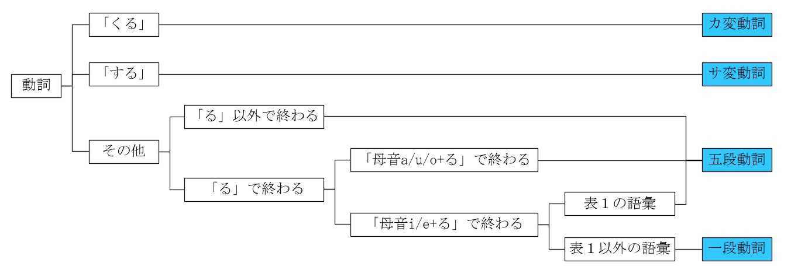
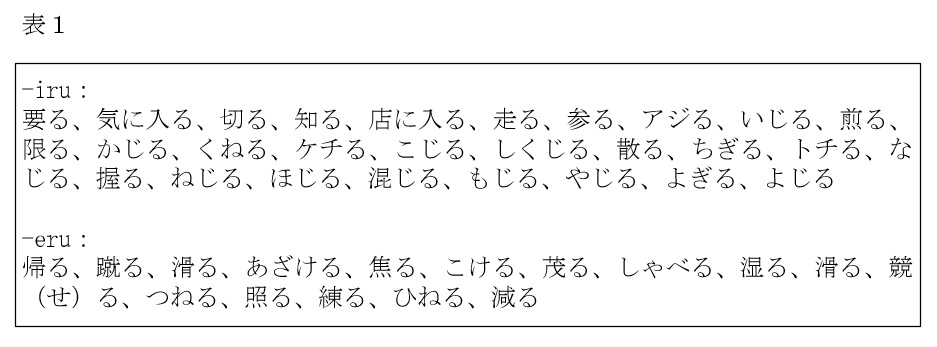
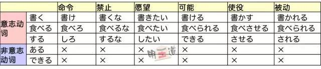
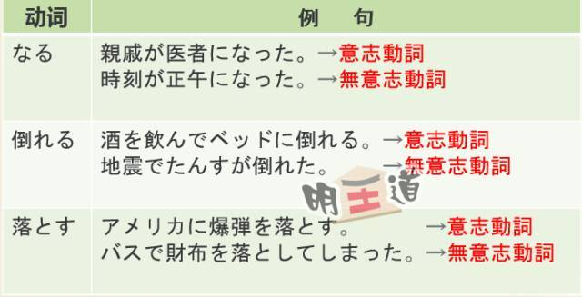

# 日语动词笔记

## 按“五段動詞、一段動詞、カ変動詞、サ変動詞”分类

　　参考下图[^1]：

## 按“自動詞、他動詞”分类

　　例如：

| 自動詞 | 他動詞 |
| :----: | :----: |
| 決まる | 決める |
| 始まる | 始める |

## 按“意志性动词、非意志性动词”分类

　　一般来说，**他动词**都是**意志性动词**，**自动词**有**意志动词**和**非意志性动词**。示例[^2]如下：

当然，也有在不同场合既可以充当意志性动词也可以充当非意志性动词的词：

## 动词活用

　　动词的活用形有未然形，连用形，终止形，连体形，假定形，命令形，推量形（争议，可以归入未然形）。

　　对于五段动词来说：

- 未然形词尾为あ段
- 连用形词尾为い段
- 终止形词尾为う段
- 连体形词尾为う段
- 假定形词尾为え段
- 命令形词尾为え段
- 推量形词尾为お段

以下是一些用法：

| 教育语法 |                           学校语法                           |
| :------: | :----------------------------------------------------------: |
|   て形   |                    连用形 + 接续助词“て”                     |
|  ます形  |                    连用形 + 助动词“ます”                     |
|  ない形  |                    未然形 + 助动词“ない”                     |
|   原形   |                        终止形，连体形                        |
|  命令形  |      命令形 命令形 + 接续助词“ろ” こい しろ      |
|   ば形   |         假定形 + 接续动词“ば” きれば すれば          |
|  意志形  | 五段动词推量形 + 助动词“う” 一段动词推量形 + 助动词“よう” こよう しよう |
|  使役形  | 五段动词未然形 + 助动词“せる” 一段动词未然形 + 助动词“させる” こさせる させる |
|  被动形  | 五段动词未然形 + 助动词“れる” 一段动词未然形 + 助动词“られる” こられる される |
|  可能形  | 五段动词未然形 + 助动词“れる”（五段动词发生音变：あ＋れ→え，例如“書か+れる→書ける”、“作ら＋れる→作れる”） 一段动词未然形 + 助动词“られる” こられる できる |

　　还有一些常见用法（教育语法中未给予命名的形式）：

- 连用形+助动词“たい”

　　对于“连用形+接续助词‘て’”、“连用形+接续助词‘た’”，五段动词发生音变，变化规则为：
- 行く → いって（特殊）
- 書く → 書いて
- 急ぐ → 急いで
- 飛ぶ → 飛んで
- 読む → 読んで
- 死ぬ → 死んで
- 待つ → 待って
- 売る → 売って
- 買う → 買って
- 話す → 話して（和普通的连用形没有区别）

## 参考

[^1]: [日语五段动词和一段动词究竟如何区别？](https://www.zhihu.com/question/20279652/answer/215967953)
[^2]: [不看后悔！意志性动词V.S.非意志性动词](https://zhuanlan.zhihu.com/p/24570390)
